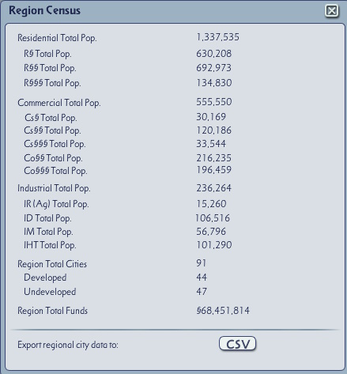

# sc4-region-census

A DLL Plugin for SimCity 4 that adds a region census UI.

The region census panel shows the totals for each RCI group in the region. It also allows the player
to export a [CSV](https://en.wikipedia.org/wiki/Comma-separated_values)file with statistics for the individual cities.
The CSV file is written using UTF-8 encoding.

The region census UI can be activated from the region view using one of the following methods:

* Clicking the middle mouse button.
* Using the `RegionCensus` cheat.

The plugin can be downloaded from the Releases tab: https://github.com/0xC0000054/sc4-region-census/releases

## System Requirements

* SimCity 4 version 641
* Windows 10 or later

The plugin may work on Windows 7 or later with the [Microsoft Visual C++ 2022 x86 Redistribute](https://aka.ms/vs/17/release/vc_redist.x86.exe) installed, but I do not have the ability to test that.

## Installation

1. Close SimCity 4.
2. Copy `SC4RegionCensus.dll` into the Plugins folder in the SimCity 4 installation directory.
3. Copy `RegionCensusUI.dat` into your SimCity 4 Plugins folder.
4. Start SimCity 4.

## Troubleshooting

The plugin should write a `SC4RegionCensus.log` file in the same folder as the plugin.    
The log contains status information for the most recent run of the plugin.

# License

This project is licensed under the terms of the MIT License.    
See [LICENSE.txt](LICENSE.txt) for more information.

## 3rd party code

[gzcom-dll](https://github.com/nsgomez/gzcom-dll/tree/master) Located in the vendor folder, MIT License.    
[EABase](https://github.com/electronicarts/EABase) Located in the vendor folder, BSD 3-Clause License.    
[EASTL](https://github.com/electronicarts/EASTL) Located in the vendor folder, BSD 3-Clause License.    
[SC4Fix](https://github.com/nsgomez/sc4fix) - MIT License.     
[Windows Implementation Library](https://github.com/microsoft/wil) - MIT License    
[ATL/AUX for ATL 7](https://web.archive.org/web/20080105105225/https://nozillium.com/atlaux/) - Public Domain    

# Source Code

## Prerequisites

* Visual Studio 2022

## Building the plugin

* Open the solution in the `src` folder
* Update the post build events to copy the build output to you SimCity 4 application plugins folder.
* Build the solution

## Debugging the plugin

Visual Studio can be configured to launch SimCity 4 on the Debugging page of the project properties.
I configured the debugger to launch the game in full screen with the following command line:    
`-intro:off -CPUcount:1 -w -CustomResolution:enabled -r1920x1080x32`

You may need to adjust the resolution for your screen.
